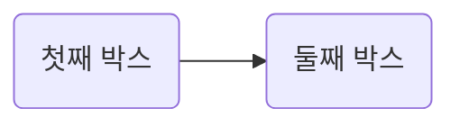

# 뷰 관련 개인 연습장

뷰.js 관련 된 내용을 기록하는 연습장.

## 다이어그램(mermaid.js) 지원

````markdown

````


## 뷰티파이 지원
 
뷰티파이 컴포넌트도 쓸 수 있다. 좀 짜게 식는 소리지만, 쓰면 좋은데 IDE 코드 정렬이나 지원이 작동하지 않는다.

아래는 완전히 한 화면을 나타내는 레이아웃.

 ```vue
<v-app>
  <v-navigation-drawer app></v-navigation-drawer>
  <v-toolbar app></v-toolbar>
  <v-content>
    <v-container fluid>
      <v-layout>
        <v-flex>
        <v-alert :value="true" type="success">
            This is a success alert.
          </v-alert>
        </v-flex>
      </v-layout>      
    </v-container>
  </v-content>
  <v-footer app></v-footer>
</v-app>
```

귀찮으면 `v-alert` 같은 요소만 써도 되는데, 최소한의 레이아웃 배치 하고 싶으면 `v-layout - vflex` 이용.

```vue
<v-app>
  <v-layout row justify-space-between>
    <v-flex>
      <v-alert :value="true" type="success"> 성공 </v-alert>
    </v-flex>
    <v-flex>
      <v-alert :value="true" type="info"> 정보 </v-alert>
    </v-flex>
    <v-flex>
      <v-alert :value="true" type="warning"> 경고 </v-alert>
    </v-flex>
    <v-flex>
      <v-alert :value="true" type="error">오류</v-alert>
    </v-flex>
  </v-layout> 
</v-app>
```

<v-app>
  <v-layout row justify-space-between>
    <v-flex>
      <v-alert :value="true" type="success"> 성공 </v-alert>
    </v-flex>
    <v-flex>
      <v-alert :value="true" type="info"> 정보 </v-alert>
    </v-flex>
    <v-flex>
      <v-alert :value="true" type="warning"> 경고 </v-alert>
    </v-flex>
    <v-flex>
      <v-alert :value="true" type="error">오류</v-alert>
    </v-flex>
  </v-layout>      
</v-app>

<v-style>
.application--wrap{
    min-height: auto;
}
</v-style>

주의할 점은.

1. 무조건 **v-app** 아래에 넣어야 css 가 먹힌다.  
2. `application--wrap` 높이 설정을 아래처럼 해줘야 높이가 무조건 800px 가 아닌, 내용물에 맞춰진다.

```vue
  <v-style>
  .application--wrap{
      min-height: auto;
  }
  </v-style>
```

## 자바스크립트 콘솔 박스 지원

console.info 등 글씨가 아닌 건 출력이 잘 안 됨. 엣지에서 오작동.

<conso></conso>


## 커스텀 콘솔 박스 지원

내가 정의한 명령과 그 출력을 가지는 터미널 박스.

<v-custom-console :settings="overSettings" />

```js {mixin:true}
{
    data(){
        return {
            overSettings : {
            welcome: `콘솔 박스 준비 완료! support() 와 status() 가능!`,
            placeholder: '명령입력: ',
              commands: {
                support () {
                  return {
                    guide: 'Contact a client speciailist',
                    command () {
                      return 'Contacting a client solutions specialist, hold on...'
                    }
                  }
                },
                reboot () {
                  return {
                    guide: 'Restarts the program',
                    command () {
                      setTimeout(function () { location.reload() }, 1000)
                      return '<span style="color: red">Rebooting...</span>'
                    }
                  }
                }
              }
            }
        }
    }
}

```

